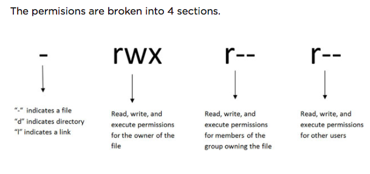

#### "On a UNIX system, everything is a file; if something is not a file, it is a process."

##### Exceptions are:
- Directories: files that are lists of other files.
- Special files: the mechanism used for input and output.
- Links: a system to make a file or directory visible in multiple parts of the system's file tree. 
- (Domain) sockets: a special file type, similar to TCP/IP sockets, providing inter-process networking
protected by the file system's access control.
- Named pipes: act more or less like sockets and form a way for processes to communicate with each
other, without using network socket semantics.

##### Inode
```
Each object in the filesystem is represented by an inode. 
It has following attributes:
File type (executable, block special etc)
Permissions (read, write etc)
Owner
Group
File Size
File access, change and modification time (remember UNIX or Linux never stores file creation time, this is favorite question asked in UNIX/Linux sys admin job interview)
File deletion time
Number of links (soft/hard)
Extended attribute such as append only or no one can delete file including root user (immutability)
Access Control List (ACLs)

```
###### Using inode information
```
stat file
```

##### Common directories and locations:

| Directory            | Description  | 
|---                   |---|
| /bin, /sbin, /usr                 |  Applications, services, user apps and libs  | 
| /dev                 | Device references represented as files  | 
| /etc                 | System configuration files  |
| /home/USERNAME, /root  | User's home directories. /root - is for root user |
| /opt                 | Third party software.   |
| /proc                | Virtual FS for processes.    |
| /var                 | Storage for all variable files and temporary files created by users    |
| /tmp                 | Storage for all variable files and temporary files created by users    |

##### Review the file system of a real production server

#### Navigation and path
##### Navigation with CD
```
cd /full
cd relative
cd -
cd 'my dir'
cd ~
```
##### Full and relative path & $PATH variable
##### Finding files location
```
find . -name "*.tmp"
find . -size +5000k
```

#### File System permissions
##### Understanding permissions
```
[username@server groupname]$ ls -lah
total 12M
drwxrwxr-x  3 username groupname 4.0K Oct 24 12:37 .
drwx------ 25 username groupname 4.0K Oct 24 05:28 ..
-rw-rw-r--  1 username groupname  135 Apr 20  2016 asset.hcl
lrwxrwxrwx  1 username groupname    9 Oct 24 12:37 link -> envconsul
-rwxr-xr-x  1 username groupname  12M Feb 19  2016 envconsul
-rwxr-xr-x  1 root     root      317 Feb  3  2016 runner.sh
drwxrwxr-x  2 username groupname 4.0K Oct 24 12:36 test
```


It is easy to think of the permission settings as a series of bits (which is how the computer thinks about them). Here's how it works:

rwx rwx rwx = 111 111 111
rw- rw- rw- = 110 110 110
rwx --- --- = 111 000 000

###### Common permission settings:
- 777  Anybody may do anything.
- 755 The file's owner may read, write, and execute the file. All others may read and execute the file. This setting is common for programs that are used by all users.
- 700 The file's owner may read, write, and execute the file. Nobody else has any rights. This setting is useful for programs that only the owner may use and must be kept private from others.
- 666 All users may read and write the file.
- 644 The owner may read and write a file, while all others may only read the file. A common setting for data files that everybody may read, but only the owner may change.
- 600 The owner may read and write a file. All others have no rights. A common setting for data files that the owner wants to keep private.

##### Changing permissions

```
chown user: file
chown :groupname file
chown user:groupname tmpfile

chmod 711 executable
chmod -R 755 directory-name/
```

#### Using links
When several users or apps need access to the same file, it is possible to create a link to the file 
 A symbolic link points to another file by name and hard link - by inode number.
 
```
ls -i file

ln /root/file1 /root/file2
ln -s file linktofile

echo "Hello" > file1
echo "World" > file2
ln file1 file1-hard
ln -s file2 file2-soft


```

#### Named pipes 
FIFO opened for reading
Writer opens FIFO - reader is unlocked, reading process gets EOF

```
mkfifo testpipe
sleep 999 > testpipe &

cat testpipe
cat testpipe

echo "1" > testpipe
echo "2" > testpipe
```

#### Using ACLs
```
setfacl -m u:nginx:r test
setfacl -Rm g:testusers:r appdir/

setfacl -x u:nginx test
runuser -l nginx -c 'ulimit -SHa'
getfact file
```
https://www.centos.org/docs/5/html/Deployment_Guide-en-US/ch-acls.html
